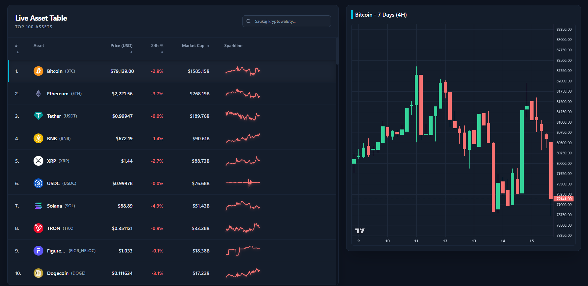

# Crypto Dashboard 🚀



Profesjonalny, responsywny dashboard do śledzenia cen i wykresów kryptowalut w czasie rzeczywistym. Projekt zbudowany w oparciu o nowoczesny stos technologiczny z wykorzystaniem React, TypeScript, Vite oraz Tailwind CSS.

## 🌟 Funkcje (Features)
- 📊 **Tabela Kryptowalut:** Przejrzysta lista top 100 najpopularniejszych kryptowalut z danymi o cenie, zmianie 24h, kapitalizacji i małym wykresem liniowym (Sparkline).
- 📈 **Wykresy Świecowe (Candlestick Charts):** Interaktywne wykresy OHLC oparte o bibliotekę *TradingView Lightweight Charts*.
- 🎨 **Nowoczesny UI/UX:** Ciemny motyw (Dark Mode) z dopracowanymi detalami, stworzony w Tailwind CSS.
- 📱 **Responsywność:** Layout w pełni dostosowujący się do urządzeń mobilnych oraz szerokich monitorów (Fluid Design).
- ⚡ **Wydajność:** Oparte na Vite dla błyskawicznego środowiska deweloperskiego i optymalnej paczki produkcyjnej.

## 📸 Zrzuty ekranu (Screenshots)

| Widok główny (Desktop) | Widok wykresu (Desktop) |
| --- | --- |
| <!-- TODO: Dodaj zrzut ekranu widoku głównego w to miejsce, np.  --> | <!-- TODO: Dodaj zrzut ekranu widoku z wykresem w to miejsce --> |

> *Wskazówka: Zrób zrzuty ekranu swojej aplikacji i umieść je w folderze np. `docs/` lub bezpośrednio przeciągnij do edytora na GitHubie, a następnie zamień powyższe komentarze na linki do obrazów.*

## 🛠️ Technologie i narzędzia (Tech Stack)

Projekt wykorzystuje następujące biblioteki i narzędzia:

**Frontend Core:**
- **React 19** - Biblioteka UI
- **TypeScript** - Typowanie statyczne
- **Vite 8** - Szybki bundler i serwer deweloperski
- **React Router v7** - Obsługa routingu po stronie klienta

**Styling & UI:**
- **Tailwind CSS v4** - Framework CSS utility-first
- **Lucide React** - Nowoczesne i lekkie ikony
- **React Hot Toast** - Powiadomienia (Toasty)

**Data Fetching & State Management:**
- **Axios** - Klient HTTP do komunikacji z zewnętrznym API
- **@tanstack/react-query** - Pobieranie, cachowanie i zarządzanie stanem zapytań API

**Wykresy (Charts):**
- **TradingView Lightweight Charts** - Renderowanie wydajnych wykresów świecowych OHLC
- **Recharts** - Renderowanie mniejszych wykresów (np. Sparklines)

## 🏗️ Architektura (Architecture)

Projekt używa struktury katalogów bazującej na podejściu *Feature-Slices* (modułowość i separacja kodu):

```
src/
├── api/                  # Konfiguracja klienta HTTP (Axios)
├── assets/               # Statyczne pliki, grafiki, czcionki
├── components/           # Reużywalne komponenty współdzielone (np. Buttons, Inputs)
├── features/             # Logika i komponenty podzielone na konkretne funkcjonalności
│   └── coin-list/        # Główna funkcjonalność: lista i wykresy coinów
│       ├── api/          # Serwisy odpowiedzialne za pobieranie danych dla tego ficzera
│       ├── components/   # Komponenty używane tylko w liście (np. CandleChart, Table)
│       ├── hooks/        # Customowe hooki np. do pobierania wykresów (useOHLC)
│       └── types/        # Typy TypeScript specyficzne dla tego modułu
├── hooks/                # Globalne custom hooki (np. obsługa theme'u)
├── layout/               # Główne komponenty układu strony (np. MainLayout)
├── types/                # Globalne definicje typów TypeScript
├── App.tsx               # Główny plik konfiguracyjny (Routing)
└── main.tsx              # Punkt wejścia aplikacji (React DOM)
```

## 🚀 Jak uruchomić lokalnie (Getting Started)

Aby sklonować i uruchomić projekt na swoim komputerze, wykonaj poniższe instrukcje.

### Wymagania (Prerequisites)
- [Node.js](https://nodejs.org/) (zalecana wersja LTS)
- Menadżer pakietów: `npm`, `yarn` lub `pnpm`

### Instalacja i uruchomienie

1. **Sklonuj repozytorium:**
   ```bash
   git clone https://github.com/twoj-login/crypto-dashboard.git
   cd crypto-dashboard/frontend
   ```

2. **Zainstaluj zależności:**
   ```bash
   npm install
   # lub
   yarn install
   ```

3. **Uruchom serwer deweloperski:**
   ```bash
   npm run dev
   # lub
   yarn dev
   ```

4. **Otwórz w przeglądarce:**
   Wejdź na stronę `http://localhost:5173` (domyślny port Vite).

## 📡 API (Źródło danych)

Dashboard pobiera dane z zewnętrznego API.
Wszystkie zapytania są obsługiwane i cachowane za pomocą pakietu **React Query**, co optymalizuje liczbę odpytań i zapobiega niepotrzebnemu zużyciu limitów (Rate Limits).

## 📜 Skrypty NPM (Available Scripts)

- `npm run dev` - Uruchamia środowisko lokalne (Vite).
- `npm run build` - Kompiluje TypeScript i buduje zoptymalizowaną paczkę do katalogu `dist`.
- `npm run preview` - Uruchamia podgląd zbudowanej paczki (produkcyjnej) na lokalnym serwerze.
- `npm run lint` - Uruchamia sprawdzanie składni za pomocą ESLinta.

## 🤝 Kontrybucja (Contributing)

Jeśli masz pomysł na rozwój projektu, zapraszam do zgłaszania Issues oraz tworzenia Pull Requests!

## 📝 Licencja (License)

Ten projekt jest udostępniany na licencji MIT. Więcej informacji znajdziesz w pliku `LICENSE`.
